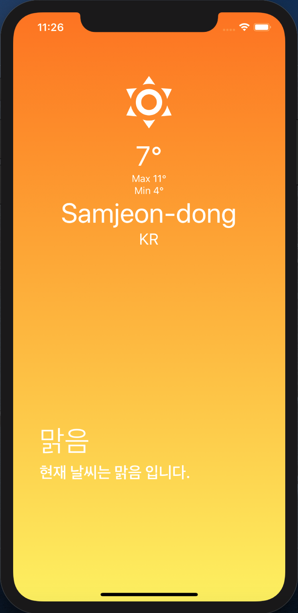

## 0. Display


## 1. 라이브러리
- import { Alert } from "react-native";
- import * as Location from "expo-location";
- import axios from "axios";

## 2. 기능구현 
- 기존 nomad code는 현재위치, 현재기온, title, substitle 구현
- 추가로 temp_min, temp_max, 현재위치표시 및 국가 구현
- openweathermap.org에서 Weather API 획득

```
getWeather = async (latitude, longitude) => {
    const {
      data: {
        main: { temp,temp_min,temp_max },
        weather,
        name,
        sys:{country}

      }
    } = await axios.get(
      `http://api.openweathermap.org/data/2.5/weather?lat=${latitude}&lon=${longitude}&APPID=${API_KEY}&units=metric`
    );
```


```
render() {
    const { isLoading, temp, condition, place,con, temp_max, temp_min} = this.state;
    return isLoading ? (
      <Loading />
    ) : (
      <Weather temp={Math.round(temp)} condition={condition} place={place} con={con}
      temp_max={Math.round(temp_max)} temp_min={Math.round(temp_min)}/>
    );
  }
```

## 3. 화면출력
```
export default function Weather({ temp, condition,place,con, temp_min, temp_max }) {
  return (
    <LinearGradient
      colors={weatherOptions[condition].gradient}
      style={styles.container}
    >
      <StatusBar barStyle="light-content" />
      <View style={styles.halfContainer}>
        <MaterialCommunityIcons
          size={96}
          name={weatherOptions[condition].iconName}
          color="white"
        />
        <Text style={styles.temp}>{temp}°</Text>
        <Text style={styles.temp_min}>Max {temp_max}°</Text>
        <Text style={styles.temp_min}>Min {temp_min}°</Text>
        <Text style={styles.place}>{place}</Text>
        <Text style={styles.con}>{con}</Text>
      </View>
      <View style={styles.textContainer}>
        <Text style={styles.title}>{weatherOptions[condition].title}</Text>
        <Text style={styles.subtitle}>
          {weatherOptions[condition].subtitle}
        </Text>
      </View>
    </LinearGradient>
  );
 }
```

## 4. GPS 인증과정
```
getLocation = async () => {
try {
      await Location.requestPermissionsAsync();
      const {
        coords: { latitude, longitude }
      } = await Location.getCurrentPositionAsync();
      this.getWeather(latitude, longitude);
    } catch (error) {
      Alert.alert("Can't find you.", "So sad");
    }
  };
```


